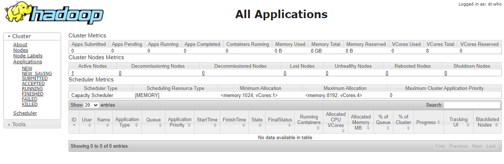
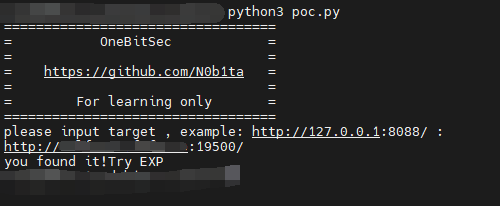
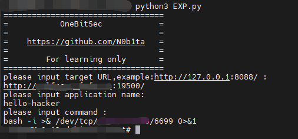
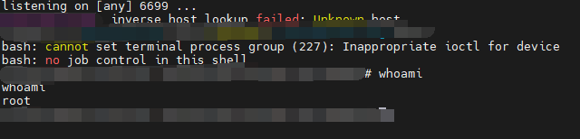

# Apache Hadoop YARN REST API Unauthorized RCE EXP&POC


This EXP&POC is used for RCE caused by unauthorized access to the Apache Hadoop YARN REST API

Signature:APACHE-hadoop-YARN

how to use:

```
pip install -r requirements.txt
python poc.py	//jest type target url
python exp.py	//you need type target url , name and RCE command
```

example:

The vulnerability web page look like this👇:



Then you can try POC👇:



And if you need , you can try EXP👇:




